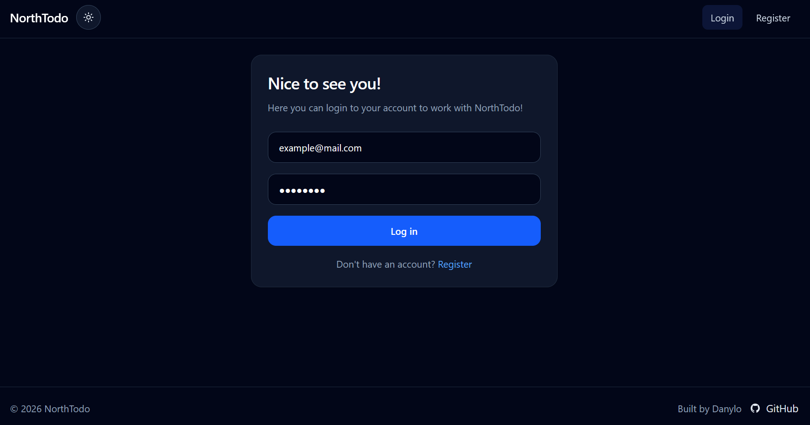
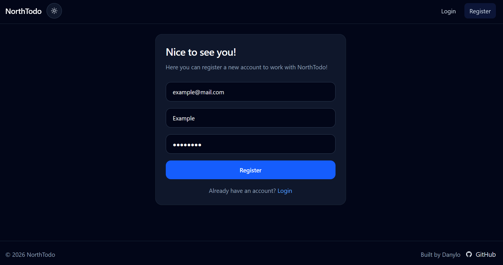
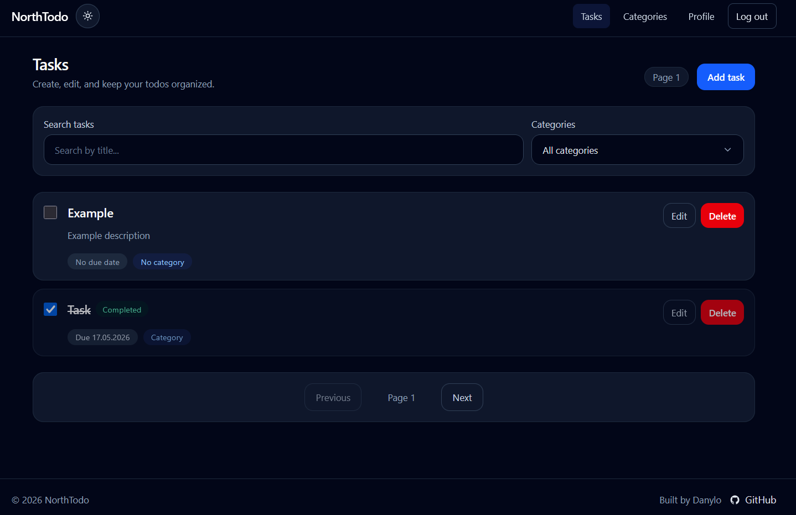
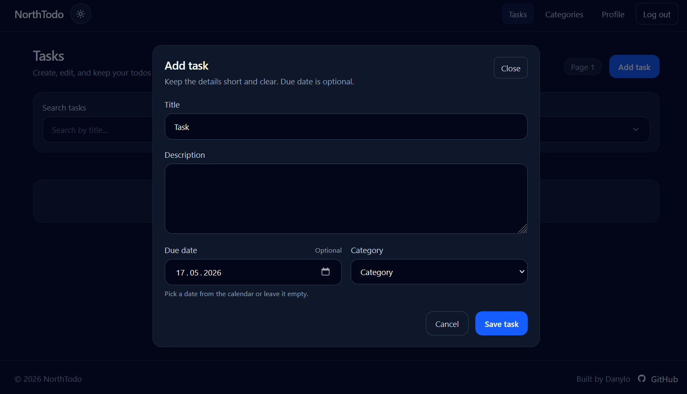
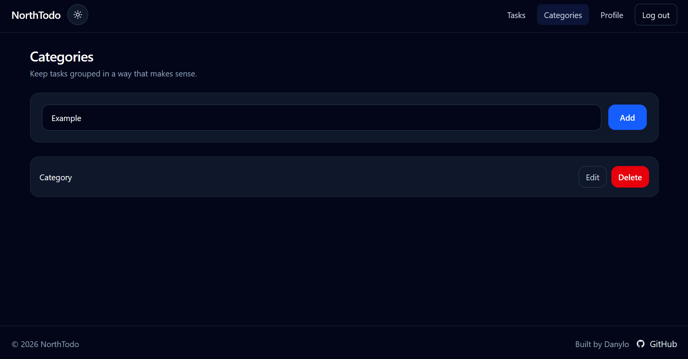
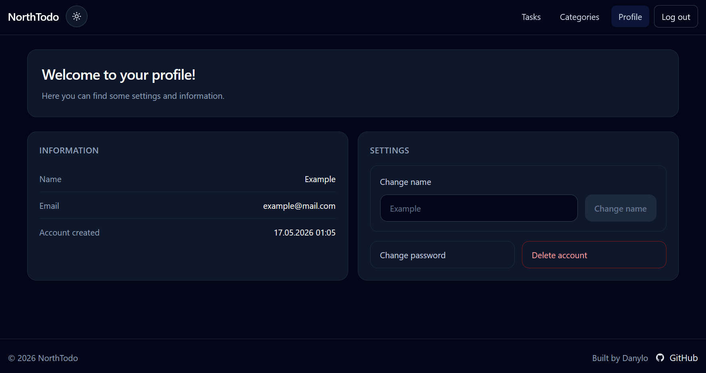
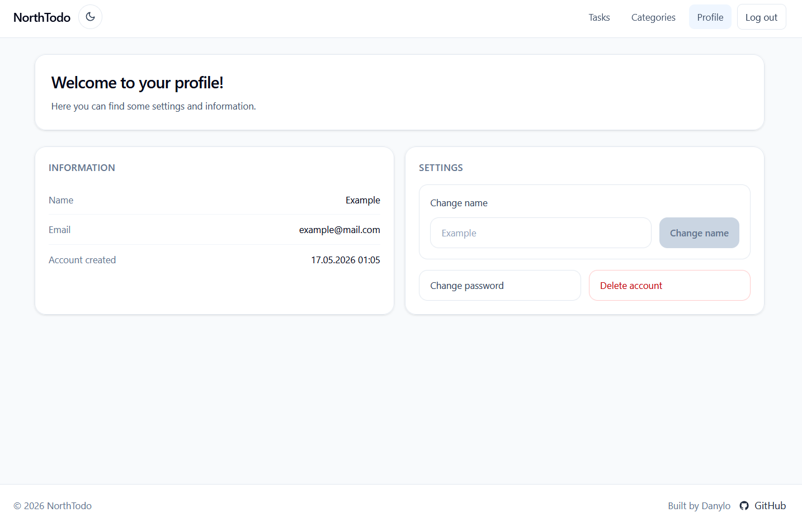

# NorthTodo

Full-stack task management application inspired by Microsoft To-Do.

Built as a personal portfolio project using Angular and ASP.NET Core Web API with JWT authentication, PostgreSQL, and a layered backend architecture.

## Live Demo

Frontend: https://northtodo.vercel.app/  
Backend API: https://northtodo-backend.onrender.com/api

> [!NOTE]
> The backend is hosted on the Render free tier.  
> After a period of inactivity, the first request may take some time while the server wakes up.

---

## Features

### Authentication
- User registration
- User login/logout
- JWT authentication
- Protected API endpoints
- Change password
- Soft delete account

### Tasks
- Create tasks
- Edit tasks
- Delete tasks
- Mark tasks as completed
- Optional due date
- Pagination
- Search by title/description
- Category filtering

### Categories
- Create categories
- Edit categories
- Delete categories
- Assign categories to tasks

### UI / UX
- Dark/light theme toggle
- Responsive layout
- Modal-based task editing/creation
- Loading and error states
- Route guards for authenticated pages

---

## Tech Stack

### Frontend
- Angular 21
- TypeScript
- Tailwind CSS
- RxJS

### Backend
- ASP.NET Core Web API (.NET 8)
- Entity Framework Core
- AutoMapper
- JWT Bearer Authentication

### Database
- PostgreSQL
- Npgsql Entity Framework Provider

### Hosting
- Vercel (frontend)
- Render (backend)
- Neon (PostgreSQL)

---

## Project Structure

```text
NorthTodo/
│
├── src/
│   ├── backend/
│   │   ├── NorthTodo.API
│   │   ├── NorthTodo.Services
│   │   ├── NorthTodo.Interfaces
│   │   └── NorthTodo.DataAccess
│   │
│   └── frontend/
│       └── src/app/
│           ├── pages
│           ├── services
│           ├── guards
│           ├── interceptors
│           └── interfaces
│
└── README.md
```

---

## Backend Architecture

The backend follows a simple 4-layer architecture:

```text
Controllers -> Services -> DataAccess -> PostgreSQL
```

### Layers

#### NorthTodo.API
Contains:
- controllers
- middleware
- authentication configuration
- dependency injection setup

#### NorthTodo.Services
Contains:
- business logic
- service implementations

#### NorthTodo.Interfaces
Contains:
- DTOs
- entities
- interfaces
- mapping profiles

#### NorthTodo.DataAccess
Contains:
- Entity Framework Core context
- migrations
- database configuration

---

## API Overview

### Authentication
- `POST /api/auth/register`
- `POST /api/auth/login`
- `POST /api/auth/change-password`

### Tasks
- `GET /api/task`
- `GET /api/task/{id}`
- `POST /api/task`
- `PUT /api/task/{id}`
- `DELETE /api/task/{id}`

### Categories
- `GET /api/category`
- `GET /api/category/{id}`
- `POST /api/category`
- `PUT /api/category/{id}`
- `DELETE /api/category/{id}`

### User
- `GET /api/user/profile`
- `PUT /api/user/profile`
- `DELETE /api/user/delete-account`

---

## Local Setup

### Prerequisites

Make sure you have installed:
- .NET 8 SDK
- Node.js
- npm
- PostgreSQL

---

# Backend Setup

## 1. Navigate to backend folder

```bash
cd src/backend
```

## 2. Configure `appsettings.json`

Example:

```json
{
    "ConnectionStrings": {
        "DefaultConnection": "YOUR_CONNECTION_STRING"
    },

    "Logging": {
        "LogLevel": {
            "Default": "Information",
            "Microsoft.AspNetCore": "Warning"
        }
    },

    "Jwt": {
        "Key": "YOUR_SUPER_SECRET_KEY_123456789",
        "Issuer": "NorthTodo",
        "Audience": "NorthTodoUsers"
    },

    "AllowedHosts": "*"
}
```

You can also use:
- `appsettings.Development.json`
- environment variables
- user secrets

---

## 3. Apply migrations

```bash
dotnet ef database update \
  --project NorthTodo.DataAccess \
  --startup-project NorthTodo.API
```

---

## 4. Run backend

```bash
dotnet run --project NorthTodo.API
```

Default local API URL:

```text
http://localhost:5000
```

---

# Frontend Setup

## 1. Navigate to frontend folder

```bash
cd src/frontend
```

## 2. Install dependencies

```bash
npm install
```

---

## 3. Configure environment

The frontend API URL is configured in:

```text
src/frontend/src/app/environments/environment.ts
```

Current configuration:

```ts
export const environment = {
  apiUrl: 'https://northtodo-backend.onrender.com/api'
};
```

For local development, replace the URL with your local backend address if needed.

Example:

```ts
export const environment = {
  apiUrl: 'http://localhost:5000/api'
};
```

---

## 4. Run frontend

```bash
npm start
```

Default frontend URL:

```text
http://localhost:4200
```

---

## Using Neon Instead of Local PostgreSQL

If you prefer using Neon:

1. Create a PostgreSQL database on Neon
2. Copy the connection string
3. Replace `DefaultConnection` in backend configuration

Example:

```json
"ConnectionStrings": {
  "DefaultConnection": "YOUR_NEON_CONNECTION_STRING"
}
```

---

## Screenshots

### Login



### Register



### Tasks



### Add Task



### Categories



### Profile



### Light Theme



---

## Known Limitations

- The backend uses Render free tier hosting, so cold starts may occur after inactivity.
- JWT authentication currently does not use refresh tokens.
- Multi-category filtering is partially handled on the frontend and is not fully server-side.
- Frontend automated tests are not fully configured yet.
- The frontend currently requires manual API URL configuration for local development.

---

## Future Improvements

- Refresh token support
- Backend and frontend automated tests
- Fully server-side multi-category filtering
- User avatar support
- Drag-and-drop task ordering
- GitHub Actions CI setup
- Docker Compose local setup

---

## Development Notes

- Swagger is enabled in development mode.
- JWT tokens are stored in localStorage.
- The backend uses soft delete for user accounts.
- Category assignment on tasks is optional.
- The application uses server-side pagination.

---

## License

This project is created for learning and portfolio purposes.

